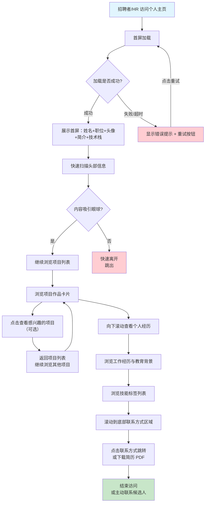

# 产品需求文档：个人主页 - V1.0

## 1. 综述 (Overview)

### 1.1 项目背景与核心问题

**项目背景**：
云舒希望构建一个个人作品展示主页，面向招聘者和 HR，以专业的方式展示个人作品、项目经历和专业技能，提升个人品牌形象，增强在求职市场上的竞争力。

**核心问题**：
- 招聘者/HR 在筛选候选人时，需要快速了解候选人的技术能力、项目经验和专业背景
- 当前缺乏一个集中的、专业的作品展示平台来呈现个人价值
- 需要通过视觉设计和内容组织，在众多候选人中脱颖而出

---

### 1.2 核心业务流程 / 用户旅程地图

1.  **首次接触** - 招聘者/HR 访问主页，第一印象评估视觉风格专业度
2.  **快速扫描** - 快速了解姓名、职位、技术栈和一句话定位
3.  **深入了解** - 浏览项目作品，评估项目质量和复杂度
4.  **建立信任** - 查看个人经历和专业技能，建立专业可信度
5.  **下一步** - 查找联系方式或下载简历，决定是否主动联系

---

### 1.3 Mermaid 图（流程/状态/时序）

#### 1.3.1 用户操作流（必填）



---

## 2. 用户故事详述 (User Stories)

### 阶段一：首次接触

---

#### **US-01: 首屏展示**

*   **价值陈述 (Value Statement)**:
    *   **作为** 招聘者/HR
    *   **我希望** 在进入主页时能够快速看到候选人的基本信息（姓名、职位、技术栈）
    *   **以便于** 在 3 秒内判断候选人是否符合招聘需求，决定是否继续浏览

*   **业务规则与逻辑 (Business Logic)**:
    1.  **前置条件**: 用户通过浏览器访问个人主页 URL
    2.  **操作流程 (Happy Path)**:
        - 页面开始加载，显示加载状态（可选）
        - 首屏内容从上到下依次渐入显示：
          - 头像从 0 渐入放大到正常尺寸
          - 姓名从上往下渐入
          - 职位从下往上渐入
          - 一句话简介逐行渐入
          - 技术栈标签从左到右依次渐入
        - 首屏加载完成，页面可正常交互
    3.  **异常处理 (Error Handling)**:
        - 头像加载失败：显示默认占位图或隐藏头像区域
        - 页面加载超时（>5秒）：显示错误提示页面 + 重试按钮
        - 网络断开：显示离线提示 + 刷新按钮

*   **验收标准 (Acceptance Criteria)**:
    *   **场景1: 首屏加载成功**
        *   **GIVEN** 用户通过浏览器访问主页
        *   **WHEN** 页面加载完成
        *   **THEN** 依次显示：圆形头像、姓名、职位、一句话简介、技术栈标签（约10个）
    *   **场景2: 头像加载失败**
        *   **GIVEN** 头像图片加载失败
        *   **WHEN** 头像无法显示
        *   **THEN** 显示默认占位图或隐藏头像区域，其他内容正常显示
    *   **场景3: 页面加载超时**
        *   **GIVEN** 页面加载超过 5 秒仍未完成
        *   **WHEN** 用户等待超时
        *   **THEN** 显示错误提示页面，包含重试按钮，点击可重新加载
    *   **场景4: 首屏动效展示**
        *   **GIVEN** 首屏元素依次加载
        *   **WHEN** 元素进入视口
        *   **THEN** 每个元素有渐入动画，整体加载时间约 1.2-1.5 秒

---

*   **页面布局线框图 (ASCII Wireframe)**:

```
┌─────────────────────────────────────────────────────────────────┐
│                                                                 │
│                        【首屏区域】                              │
│                                                                 │
│           ┌───────────────────────────┐                         │
│           │                           │                         │
│           │      ╭─────────────────╮   │                         │
│           │      │                 │   │                         │
│           │      │    你的头像      │   │    ← 头像 (圆形裁切)    │
│           │      │    (img)        │   │                         │
│           │      │                 │   │                         │
│           │      ╰─────────────────╯   │                         │
│           │                           │                         │
│           │    云舒                  │    ← 姓名                 │
│           │    前端开发工程师        │    ← 职位                 │
│           │                           │                         │
│           │  "用技术构建优雅的用户   │    ← 一句话简介           │
│           │   体验，让复杂变简单"    │                         │
│           │                           │                         │
│           │  ┌──────┐ ┌──────┐ ┌──────┐ ┌──────┐ ┌──────┐     │
│           │  │React │ │Vue3  │ │TS    │ │Node  │ │Git   │     │
│           │  └──────┘ └──────┘ └──────┘ └──────┘ └──────┘     │
│           │  ┌──────┐ ┌──────┐ ┌──────┐ ┌──────┐              │
│           │  │CSS3  │ │Antd  │ │Vite  │ │Docker│   ← 技术栈标签  │
│           │  └──────┘ └──────┘ └──────┘ └──────┘              │
│           │                           │                         │
│           └───────────────────────────┘                         │
│                                                                 │
│  【配色方案】                                                   │
│  背景色：蓝黑 (#0f172a)                                         │
│  文字色：白色 (#ffffff)                                         │
│  强调色：青色 (#06b6d4) 用于姓名、标签边框等                    │
│  次要文字：灰白色 (#94a3b8) 用于职位、简介                     │
│  标签背景：青色半透明 (#06b6d4 + 10% opacity)                   │
│                                                                 │
│  【动效说明】                                                   │
│  1. 头像从 0 渐入放大到正常尺寸（0.5s ease-out）               │
│  2. 姓名从上往下渐入（0.3s ease-out，延迟 0.2s）               │
│  3. 职位从下往上渐入（0.3s ease-out，延迟 0.3s）               │
│  4. 简介逐行渐入（每行 0.1s，延迟 0.4s）                       │
│  5. 技术栈标签从左到右依次渐入（每个 0.1s，延迟 0.6s）         │
│  预估总加载时间：约 1.2-1.5 秒                                  │
└─────────────────────────────────────────────────────────────────┘
```

---

### 阶段二：深入了解

---

#### **US-02: 项目作品列表展示**

*   **价值陈述 (Value Statement)**:
    *   **作为** 招聘者/HR
    *   **我希望** 能够以卡片形式浏览候选人的项目作品
    *   **以便于** 快速评估候选人的技术能力和项目经验，判断是否匹配岗位需求

*   **业务规则与逻辑 (Business Logic)**:
    1.  **前置条件**: 用户已完成首屏浏览，决定继续向下滚动
    2.  **操作流程 (Happy Path)**:
        - 滚动进入项目作品区域
        - 卡片从下往上依次渐入显示
        - 每个项目卡片包含：封面图、名称、一句话简介、技术栈标签、链接按钮
        - 项目按时间倒序排列（最新在前）
        - 鼠标悬停在卡片上时，卡片轻微上浮 + 阴影加深
    3.  **异常处理 (Error Handling)**:
        - 封面图加载失败：显示默认占位图或项目名称文字
        - 链接失效（GitHub/线上地址）：链接按钮置灰或点击提示"链接不可用"
        - 卡片数量为 0：显示"暂无项目"提示

*   **验收标准 (Acceptance Criteria)**:
    *   **场景1: 项目卡片展示**
        *   **GIVEN** 用户滚动到项目区域
        *   **WHEN** 页面加载完成
        *   **THEN** 显示 3-5 个项目卡片，每个卡片包含封面图、名称、简介、标签、链接
    *   **场景2: 卡片交互效果**
        *   **GIVEN** 用户鼠标悬停在项目卡片上
        *   **WHEN** 鼠标进入卡片区域
        *   **THEN** 卡片轻微上浮（2-4px）、阴影加深、封面图微放大
    *   **场景3: 封面图加载失败**
        *   **GIVEN** 项目封面图无法加载
        *   **WHEN** 图片请求失败
        *   **THEN** 显示默认占位图或直接显示项目名称
    *   **场景4: 链接点击**
        *   **GIVEN** 用户点击 GitHub 或在线演示链接
        *   **WHEN** 点击链接按钮
        *   **THEN** 在新标签页打开对应链接（如果是有效链接）

---

*   **页面布局线框图 (ASCII Wireframe)**:

```
┌─────────────────────────────────────────────────────────────────┐
│  【项目作品区域】                                               │
│                                                                 │
│  ┌─────────────────────────────────────────────────────────┐   │
│  │  项目名称：云舒的个人作品集                              │   │
│  ─────────────────────────────────────────────────────────    │
│  ┌─────────────────────────────────────────────────────────┐   │
│  │                                                         │   │
│  │         📷 项目封面截图区域 (16:9 比例)                 │   │
│  │                                                         │   │
│  └─────────────────────────────────────────────────────────┘   │
│  │  ┌─────────────────────────────────────────────────┐     │   │
│  │  │                                                 │     │   │
│  │  │  "一句话描述这个项目的核心功能或价值"              │     │   │
│  │  │                                                 │     │   │
│  │  │  ┌──────┐ ┌──────┐ ┌──────┐ ┌──────┐          │     │   │
│  │  │  │React │ │TS    │ │Vite  │ │Antd  │          │     │   │
│  │  │  └──────┘ └──────┘ └──────┘ └──────┘          │     │   │
│  │  │                                                 │     │   │
│  │  │  [GitHub] [在线演示]                            │     │   │
│  │  │                                                 │     │   │
│  │  └─────────────────────────────────────────────────┘     │   │
│  └─────────────────────────────────────────────────────────┘   │
│                                                                 │
│  ┌─────────────────────────────────────────────────────────┐   │
│  │  项目名称：待第二个项目...                               │   │
│  ─────────────────────────────────────────────────────────    │
│  │  ...（同上的卡片结构）                                  │   │
│  └─────────────────────────────────────────────────────────┘   │
│                                                                 │
│  ┌─────────────────────────────────────────────────────────┐   │
│  │  项目名称：待第三个项目...                               │   │
│  ─────────────────────────────────────────────────────────    │
│  │  ...（同上的卡片结构）                                  │   │
│  └─────────────────────────────────────────────────────────┘   │
│                                                                 │
│  【卡片样式细节】                                               │
│  卡片尺寸：圆角矩形（16px），轻微阴影                          │
│  封面区域：16:9 比例，可点击查看大图                          │
│  链接按钮：青色背景 + 白字，悬停有变色效果                     │
│                                                                 │
│  【交互动效】                                                   │
│  1. 卡片悬停：轻微上浮 + 阴影加深 + 封面图微放大              │
│  2. 滚动进入视口：卡片从下往上渐入（每个 0.3s，间隔 0.1s）     │
└─────────────────────────────────────────────────────────────────┘
```

---

### 阶段三：建立信任

---

#### **US-03: 个人经历与技能展示**

*   **价值陈述 (Value Statement)**:
    *   **作为** 招聘者/HR
    *   **我希望** 能够查看候选人的工作经历、教育背景和专业技能
    *   **以便于** 全面评估候选人的专业背景和工作能力，确认是否符合岗位要求

*   **业务规则与逻辑 (Business Logic)**:
    1.  **前置条件**: 用户已浏览完项目作品区域，继续向下滚动
    2.  **操作流程 (Happy Path)**:
        - 滚动进入个人经历区域
        - 时间线从左到右依次显示
        - 每个时间节点显示：时间点、公司/学校、职位/学历、简要描述
        - 技能标签分为三组：精通、熟练、了解
    3.  **异常处理 (Error Handling)**:
        - 经历内容为空：显示"暂无经历信息"提示
        - 技能标签为空：隐藏技能展示区域

*   **验收标准 (Acceptance Criteria)**:
    *   **场景1: 时间线展示**
        *   **GIVEN** 用户滚动到个人经历区域
        *   **WHEN** 页面加载完成
        *   **THEN** 显示时间轴，左侧是时间点和连接线，右侧是经历卡片
    *   **场景2: 工作经历展示**
        *   **GIVEN** 用户查看工作经历
        *   **WHEN** 浏览时间线
        *   **THEN** 显示：公司名称、职位名称、任职时间、工作描述（按时间倒序）
    *   **场景3: 教育背景展示**
        *   **GIVEN** 用户查看教育背景
        *   **WHEN** 浏览时间线
        *   **THEN** 显示：学校名称、专业、学历、入学-毕业时间
    *   **场景4: 技能标签展示**
        *   **GIVEN** 用户查看技能列表
        *   **WHEN** 浏览技能区域
        *   **THEN** 技能分为三组显示：精通（青色强调）、熟练（白色）、了解（灰色）

---

*   **页面布局线框图 (ASCII Wireframe)**:

```
┌─────────────────────────────────────────────────────────────────┐
│  【个人经历与技能区域】                                         │
│                                                                 │
│  ┌─────────────────────────────────────────────────────────┐   │
│  │                        工作经历                         │   │
│  │                                                         │   │
│  │  2023.03 - 至今    ┌─────────────────────────────┐     │   │
│  │    │              │  公司名称                    │     │   │
│  │    │              │  高级前端工程师              │     │   │
│  │    ●              │                             │     │   │
│  │    │              │  负责核心业务系统开发，      │     │   │
│  │  时间              │  主导团队技术选型与优化      │     │   │
│  │  轴                └─────────────────────────────┘     │   │
│  │                                                         │   │
│  │  2021.06 - 2023.02┌─────────────────────────────┐     │   │
│  │    │              │  公司名称                    │     │   │
│  │    │              │  前端开发工程师              │     │   │
│  │    ●              │                             │     │   │
│  │    │              │  参与多个 ToB 项目开发      │     │   │
│  │                    └─────────────────────────────┘     │   │
│  │                                                         │   │
│  │  2019.09 - 2021.05┌─────────────────────────────┐     │   │
│  │    │              │  学校名称                    │     │   │
│  │    │              │  本科 · 计算机科学与技术      │     │   │
│  │    ●              │                             │     │   │
│  │    │              │  在校期间...                 │     │   │
│  │                    └─────────────────────────────┘     │   │
│  │                                                         │   │
│  └─────────────────────────────────────────────────────────┘   │
│                                                                 │
│  ┌─────────────────────────────────────────────────────────┐   │
│  │                        技能标签                         │   │
│  │                                                         │   │
│  │  【精通】                                                │   │
│  │    React · TypeScript · Vue3 · JavaScript (ES6+)       │   │
│  │                                                         │   │
│  │  【熟练】                                                │   │
│  │    Node.js · Webpack · Git · Linux                     │   │
│  │                                                         │   │
│  │  【了解】                                                │   │
│  │    Python · Docker · AWS · GraphQL                     │   │
│  │                                                         │   │
│  └─────────────────────────────────────────────────────────┘   │
│                                                                 │
│  【时间线样式细节】                                             │
│  ● 时间点：青色实心圆点 (#06b6d4)                              │
│  │ 连接线：青色竖线 (2px)                                    │
│  │ 时间文字：灰白色 (#94a3b8)，字号稍小                      │
│  │ 卡片背景：稍浅的蓝黑色 (#1e293b)，圆角                   │
│                                                                 │
│  【技能标签样式】                                               │
│  【精通】青色文字 + 青色边框（左竖线）                         │
│  【熟练】白色文字 + 灰色边框                                   │
│  【了解】灰白色文字 + 虚线边框                                 │
└─────────────────────────────────────────────────────────────────┘
```

---

### 阶段四：下一步

---

#### **US-04: 联系方式与底部区域**

*   **价值陈述 (Value Statement)**:
    *   **作为** 招聘者/HR
    *   **我希望** 能够方便地获取候选人的联系方式并下载简历
    *   **以便于** 快速发起联系或进一步评估候选人

*   **业务规则与逻辑 (Business Logic)**:
    1.  **前置条件**: 用户已完成所有内容浏览
    2.  **操作流程 (Happy Path)**:
        - 滚动到底部联系方式区域
        - 显示联系方式图标按钮（邮箱、GitHub、LinkedIn 等）
        - 显示简历下载按钮
        - 底部导航链接可点击跳转
    3.  **异常处理 (Error Handling)**:
        - 链接失效：链接按钮置灰或点击提示"链接不可用"
        - 简历文件不存在：下载按钮隐藏或显示"简历暂不可用"

*   **验收标准 (Acceptance Criteria)**:
    *   **场景1: 联系方式展示**
        *   **GIVEN** 用户滚动到底部
        *   **WHEN** 页面加载完成
        *   **THEN** 显示联系方式图标按钮：邮箱、LinkedIn、GitHub
    *   **场景2: 简历下载**
        *   **GIVED** 用户点击简历下载按钮
        *   **WHEN** 按钮可点击
        *   **THEN** 下载简历 PDF 文件
    *   **场景3: 链接点击**
        *   **GIVEN** 用户点击联系方式链接
        *   **WHEN** 点击图标按钮
        *   **THEN** 在新标签页打开对应链接或触发对应操作（发邮件）
    *   **场景4: 底部导航**
        *   **GIVEN** 用户点击底部导航链接
        *   **WHEN** 点击链接
        *   **THEN** 平滑滚动到对应页面区域

---

*   **页面布局线框图 (ASCII Wireframe)**:

```
┌─────────────────────────────────────────────────────────────────┐
│  【底部联系方式区域】                                           │
│                                                                 │
│  ┌─────────────────────────────────────────────────────────┐   │
│  │                                                         │   │
│  │     [📧 邮箱]  [💼 LinkedIn]  [🐙 GitHub]              │   │
│  │                                                         │   │
│  │              [📄 下载简历 (PDF)]                       │   │
│  │                                                         │   │
│  └─────────────────────────────────────────────────────────┘   │
│                                                                 │
│  ┌─────────────────────────────────────────────────────────┐   │
│  │                                                         │   │
│  │     首页    项目    关于    联系我                       │   │
│  │                                                         │   │
│  │     © 2024 你的名字. All rights reserved.              │   │
│  │                                                         │   │
│  └─────────────────────────────────────────────────────────┘   │
│                                                                 │
│  【交互效果】                                                   │
│  · 链接按钮悬停：青云色加深，产生点击反馈                       │
│  · 平滑滚动：点击导航链接时，滚动到对应区域                    │
└─────────────────────────────────────────────────────────────────┘
```
